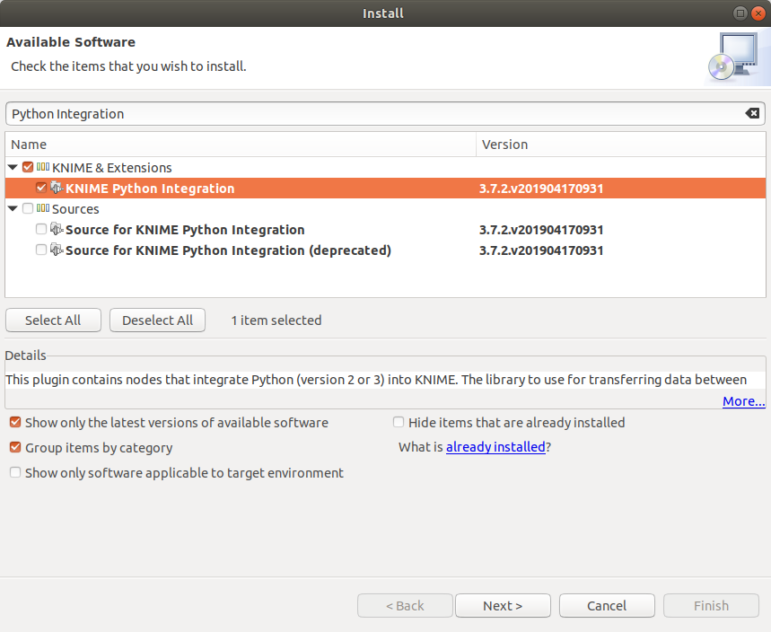
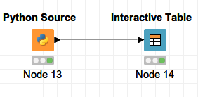
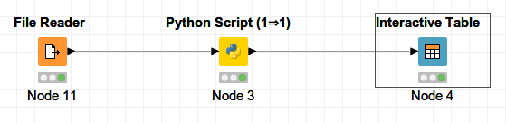

# KNIME configuration

You can install and use seq-to-first-iso with
the Analytics platform [KNIME](https://docs.knime.com/) to process data from SLIM-labeling.<br>
Requirements:
  - KNIME
  - conda
  - a little bit of Python knowledge

(Note: if you wish to use pandas > 0.23, you need to upgrade KNIME to 3.7.2 at least)

## Set Python with KNIME

You need to install and configure a Python extension.<br>
This guide is adapted from the [3.7 Python installation guide](https://docs.knime.com/2018-12/python_installation_guide/index.html) from KNIME.

### Set up the conda environment

#### Create a conda environment
In the GitHub repository, go to *knime/environment-knime.yml* and download the [raw version](https://raw.githubusercontent.com/pierrepo/seq-to-first-iso/master/knime/environment-knime.yml) of the file (*Right click → Save as ...*).<br>
Then in the directory where *environment-knime.yml* was downloaded use:

```shell
conda env create -f environment-knime.yml
```

Now if you do

```shell
conda env list
```

you should see `seq-to-first-iso-knime` in the environments.

#### Create a start script

Create a small script to start the conda environment by using the [templates defined by KNIME](https://docs.knime.com/2018-12/python_installation_guide/index.html#_creating_a_start_script_for_python).

To test if your script works, try to execute it:
- for Windows, double-click on it
- For Linux/Mac, make your file executable
  ```
  chmod gou+x <script_name>
  ```
  then execute it with
  ```
  ./<script_name>
  ```

### Configure the Python extension

In the KNIME interface, go to *File → Install KNIME Extensions*
then search for *Python Integration* to find the KNIME Python Integration.  

<br>
*KNIME Python extension in the Install window*

Now you just need to configure the Python executable KNIME will use.<br>
Go into *File → Preferences → KNIME → Python* then in the Python 3 subsection, paste the absolute path to your start script<br>
*e.g: Windows path `C:\Documents\<script_name>`, Unix path `home/<user>/<script_name>`.* <br>
Next use Python 3 as default, then Apply and close.

If everything went alright, you should now be able to use Python script nodes with KNIME.

## Use seq-to-first-iso with KNIME

Warning: the tutorial assumes you use seq-to-first-iso 0.5.0,
functions in other versions might differ. If you want to use other versions, you have to make sure [the changes across versions](https://github.com/pierrepo/seq-to-first-iso/blob/master/CHANGELOG.md) will not break your workflow.

The following steps are mostly examples, you can adapt them for your needs.

### If the file is not parsed

You can use the parsing provided by seq-to-first-iso if you want to read from a formatted file (one sequence per line).

Create a Python scripting node by going in the Node Repository then *Scripting → Python → Python Source*. Then configure the node.

```python
import seq_to_first_iso as stfi

# Parse the file, change <PATH_TO_YOUR_FILE> to your file path.
parsed_output = stfi.sequence_parser("<PATH_TO_YOUR_FILE>")
# Get rid of ignored_lines for seq_to_df.
parsed_output.pop("ignored_lines")

# List of unlabelled amino acids, change if you need.
unlabelled_aa = ["A", "C"]

# The name output_table will inform KNIME that
# the variable is an output table.
output_table = stfi.seq_to_df(unlabelled_aa=unlabelled_aa,
                              **parsed_output)
```



*Minimal implementation of a Python node without prior input in KNIME*

### If peptides are already in a table

If you already have a table with peptide sequences, you can feed it to function seq_to_df() to get the output dataframe

Create a Python scripting node by going in the Node Repository then *Scripting → Python → Python Script (1⇒1)*. The node will receive a table as an input.

```python
from seq_to_first_iso import seq_to_df

# Copy input table.
output_table = input_table.copy()

# Set the unlabelled amino acids.
unlabelled_aa = ["A", "C"]

# If the input table has more than 2 columns
# annotations will be the first column while
# sequences are the second one.
# Else, we consider the only column contains sequences.
try:
  sequences = output_table.iloc[:,1]
  # Cast pd.Series to list.
  annotations = list(output_table.iloc[:,0])
except:
  sequences = output_table.iloc[:,0]
  annotations = []

output_table = seq_to_df(sequences, unlabelled_aa, annotations=annotations)
```

In the example above, you may also chose which columns to take into account as arguments for seq_to_df().<br>
*e.g: The fourth column of your table has lists of post-translational modifications, you can capture the column in a variable with `ptms = list(output_table.iloc[:,3])` then use the variable `output_table = seq_to_df(sequences, unlabelled_aa, modifications=ptms)`.*

<br>
*Minimal implementation of a Python node with table input*
