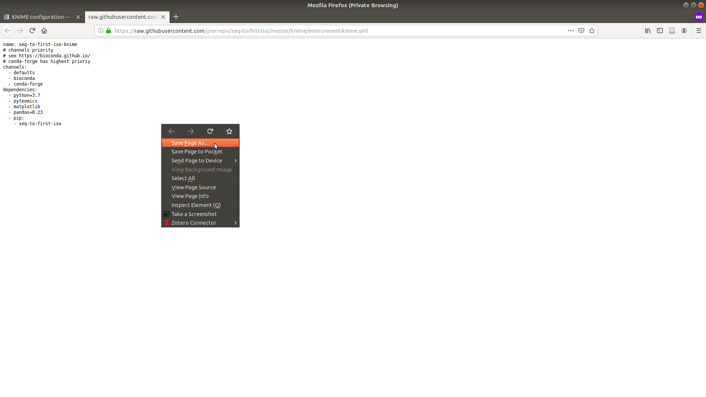

# KNIME configuration

You can install and use seq-to-first-iso with
the [KNIME](https://docs.knime.com/) Analytics Platform to process data from SLIM-labeling.

Requirements:
  - KNIME
  - conda
  - a little bit of Python knowledge

This guide is for KNIME 3.7.2 only.


## Install (Ana)conda

Install the latest version of [Anaconda](https://www.anaconda.com/) with Python 3.x.


## Install KNIME

Install KNIME 3.7.2. You can download this version [here](https://www.knime.com/download-previous-versions).


## Set up Python for KNIME

You need to install and configure a Python extension in KNIME.

This guide is adapted from the [3.7 Python installation guide](https://docs.knime.com/2018-12/python_installation_guide/index.html) from KNIME.


### Set up the conda environment

**On Windows**, if you want to use conda with the default command-line interface *CMD*, you need to do some configuration, else use *Anaconda prompt* (or any other interface that recognizes conda) bundled with conda.

If conda was not added to the PATH environment variable during the installation, you have to configure your shell to use the `conda` commands:

```
 setx PATH=%PATH%;C:<PATH_WHERE_YOU_INSTALLED_CONDA>\Scripts
```

By default `<PATH_WHERE_YOU_INSTALLED_CONDA>` is `C:\Users\<Username>\<CONDA_INSTALLATION>` where `<Username>` is the Windows username and `<CONDA_INSTALLATION>` is the name of the conda installer (e.g: "Anaconda3").


#### Create a conda environment

Download the environment file [*knime/environment-knime.yml*](https://raw.githubusercontent.com/pierrepo/seq-to-first-iso/master/knime/environment-knime.yml (*Right click → Save as ...*).



In the directory where *environment-knime.yml* has been downloaded, open a shell/*Anaconda prompt* and use:

```shell
conda env create -f environment-knime.yml
```

The command

```shell
conda env list
```

should now list `seq-to-first-iso-knime` in available environments.


#### Create a start script

Create a small script to start the conda environment by using the [templates defined by KNIME](https://docs.knime.com/2018-12/python_installation_guide/index.html#_creating_a_start_script_for_python).<br>
In our case `<ENVIRONMENT_NAME>` is `seq-to-first-iso-knime` while
`<PATH_WHERE_YOU_INSTALLED_ANACONDA>` depend on the user's conda configuration and operating sytem.

For windows, here is an example of such a script (`conda_env.bat`):
```
@REM Adapt the folder in the PATH to your system
@SET PATH=%USERPROFILE%\Miniconda3\Scripts;%PATH%
@CALL activate seq-to-first-iso-knime || ECHO Activating python environment failed
@python %*
```

### Configure the Python extension

In the KNIME interface, go to *File → Install KNIME Extensions*,
then search for *Python Integration* to find the KNIME Python Integration.  


Select and install this extension.

Then, go ot the configuration menu *File → Preferences → KNIME → Python*. In the Python 3 subsection, paste the absolute path to your start script.

*e.g: Windows path `C:\Documents\<script_name>`*

Select, Python 3 as default, then Apply and close.

If everything went alright, you should now be able to use Python script nodes with KNIME.


## Use seq-to-first-iso with KNIME

**Warning**: this tutorial assumes you use the latest version of seq-to-first-iso.

The following steps are made of examples, adapt them to your needs.

We assumes that:

- `input_table_1` contains (if any) unlabeled amino acids,
- `input_table_2` contains peptide sequences (column `pep_seq`) and charges (column `pep_charge`).

Create a Python scripting node by going in the Node Repository then *Scripting → Python → Python Script (1⇒1)*. The node will receive a table as an input.

```python
import pandas as pd
import seq_to_first_iso as stfi

print(stfi.__version__)

# List of unlabelled amino acids from multiple selection node.
# It is the first node used in this case.
unlabelled_aa = list(input_table_1.iloc[:, 0])
print("Amino acids unlabelled:", unlabelled_aa)

# Take the content of the parsed file.
# The name output_table will inform KNIME that
# the variable is an output table.
output_table = input_table_2.copy()

# Extract relevant columns
df = pd.DataFrame()
df["sequence"] = output_table["pep_seq"]
df["charge"] = output_table["pep_charge"]

# Get M0/M1 intensities
df_peptides = stfi.compute_intensities(df, unlabelled_aa)

# Export final results
output_table = stfi.export_to_knime(outpu_table, df_peptides)
```


## Update seq-to-first-iso in KNIME

### Update conda environnement 

Open *Anaconda prompt*, then enter the following commands:
```
conda activate seq-to-first-iso-knime
conda install seq-to-first-iso
```

### Update Python script

Open the Python Script node and check the content of the script is similar to the above code.

