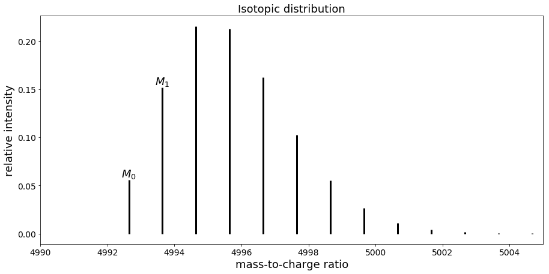
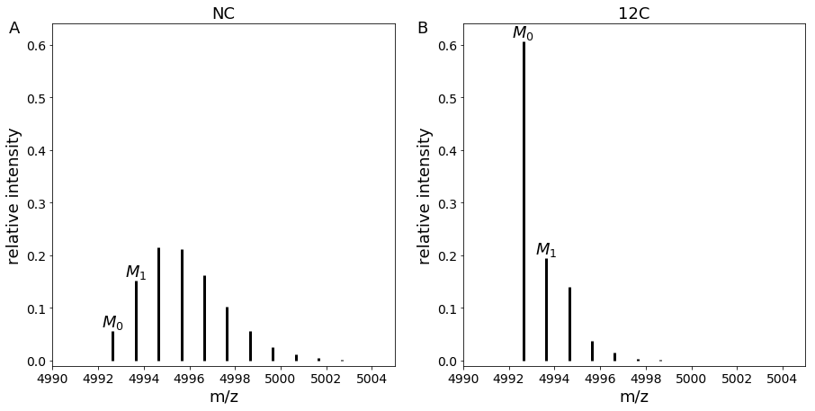

# Theoretical background

## Isotopologues in mass spectrometry

Depending on their isotopic composition, peptides have different isotopologues.

```eval_rst
+-----------+---------+-------------------------+
|  Element  | Isotope | Relative abundance (%)  |
+===========+=========+=========================+
| Hydrogen  | H[1]    | 99.9885                 |
+-----------+---------+-------------------------+
| Hydrogen  | H[2]    | 0.0115                  |
+-----------+---------+-------------------------+
| Carbon    | C[12]   | 98.93                   |
+-----------+---------+-------------------------+
| Carbon    | C[13]   | 1.07                    |
+-----------+---------+-------------------------+
| Nitrogen  | N[14]   | 99.632                  |
+-----------+---------+-------------------------+
| Nitrogen  | N[15]   | 0.368                   |
+-----------+---------+-------------------------+
| Oxygen    | O[16]   | 99.757                  |
+-----------+---------+-------------------------+
| Oxygen    | O[17]   | 0.038                   |
+-----------+---------+-------------------------+
| Oxygen    | O[18]   | 0.205                   |
+-----------+---------+-------------------------+
| Sulfur    | S[32]   | 94.93                   |
+-----------+---------+-------------------------+
| Sulfur    | S[33]   | 0.76                    |
+-----------+---------+-------------------------+
| Sulfur    | S[34]   | 4.29                    |
+-----------+---------+-------------------------+
```

*Stable isotopes of most common organic elements in peptides,
values are taken from [MIDAs](https://www.ncbi.nlm.nih.gov/CBBresearch/Yu/midas/index.html)\[1]*

The first isotopologue (noted **_M0_**) contains peptides which elements are composed of only the **lightest stable isotopes**. In contrast the second isotopologue (**_M1_**) has one of its element with a **supplementary neutron**. Isotopologues follow notation *Mn*  where *n* is the number of supplementary neutrons in the chemical formula compared to *M0*.  

e.g: the chemical formula of Glycine is "C2H5O2N1",
the different isotopic compositions for isotopologues *M0* and *M1* are described in the table below

```eval_rst
+---------------+------------------+----------------+------------------+----------+
|  Isotopologue | Carbon           | Hydrogen       | Oxygen           | Nitrogen |
+===============+==================+================+==================+==========+
| M0            | C[12]*2          | H[1]*5         | O[16]*2          | N[14]*1  |
+---------------+------------------+----------------+------------------+----------+
| M1            | C[12]*1, C[13]*1 | H[1]*5         | O[16]*2          | N[14]*1  |
+---------------+------------------+----------------+------------------+----------+
| M1            | C[12]*2          | H[1]*4, H[2]*1 | O[16]*2          | N[14]*1  |
+---------------+------------------+----------------+------------------+----------+
| M1            | C[12]*2          | H[1]*5         | O[16]*1, O[17]*1 | N[14]*1  |
+---------------+------------------+----------------+------------------+----------+
| M1            | C[12]*2          | H[1]*5         | O[16]*2          | N[15]*1  |
+---------------+------------------+----------------+------------------+----------+
```
*Composition of M0 and M1 of Glycine*

**_M0_ can only have one composition**, meanwhile
there are **multiple combinations for _M1_**, each with one of its elements swapped with a heavier isotope.
The complexity of formulas increases even more with further isotopologues.

In high-resolution mass spectrometry, the mass spectrometer
is able to differentiate peaks of isotopologues.

*Mass spectrum of peptide with sequence "VGEVFINYIQRQNELFQGKLAYLIIDTCLSIVRPNDSKPLDNR"*  

In that case, the first peak corresponds to *M0* while the second one is *M1*, the third one *M2* *etc*.


## Computation of isotopologue intensity

Isotopologue intensity can be computed analytically. <br>
Formulas are adapted from [an article by Wang, Benlian et al.](https://www.sciencedirect.com/science/article/pii/S0003269707001996)\[2].

We consider a peptide of formula
```math
{\rm C}_{n({\rm C})} {\rm H}_{n({\rm H})} {\rm O}_{n({\rm O})} {\rm N}_{n({\rm N})} {\rm S}_{n({\rm S})},
```
where *n(C)*, *n(H)*, *n(O)*, *n(N)* and *n(S)* denote the number of atoms of carbon, hydrogen, oxygen, nitrogen and sulfur respectively.

### Compute M0 intensity

For such peptide, the normalized intensity of the monoisotopic ion is given by:

```math
M_0 =  a({\rm C[12]})^{n({\rm C})}
\times a({\rm H[1]})^{n({\rm H})}
\times a({\rm O[16]})^{n({\rm O})}
\times a({\rm N[14]})^{n({\rm N})}
\times a({\rm S[32]})^{n({\rm S})},
```  
where *a(isotope)* is the relative abundance of the isotope.

### Compute M1 intensity

Following a polynomial expansion, intensity of the second isotopologue *M1* is:

```math
\begin{aligned}
M_1 &=
n({\rm C})
\times a({\rm C[12]})^{n({\rm C})-1}
\times a({\rm C[13]})
\times a({\rm H[1]})^{n({\rm H})}
\times a({\rm O[16]})^{n({\rm O})}
\times a({\rm N[14]})^{n({\rm N})}
\times a({\rm S[32]})^{n({\rm S})} \\
&+
n({\rm H})
\times a({\rm C[12]})^{n({\rm C})}
\times a({\rm H[1]})^{n({\rm H})-1}
\times a({\rm H[2]})
\times a({\rm O[16]})^{n({\rm O})}
\times a({\rm N[14]})^{n({\rm N})}
\times a({\rm S[32]})^{n({\rm S})} \\
&+
n({\rm O})
\times a({\rm C[12]})^{n({\rm C})}
\times a({\rm H[1]})^{n({\rm H})}
\times a({\rm O[16]})^{n({\rm O})-1}
\times a({\rm O[17]})
\times a({\rm N[14]})^{n({\rm N})}
\times a({\rm S[32]})^{n({\rm S})} \\
&+
n({\rm N})
\times a({\rm C[12]})^{n({\rm C})}
\times a({\rm H[1]})^{n({\rm H})}
\times a({\rm O[16]})^{n({\rm O})}
\times a({\rm N[14]})^{n({\rm N})-1}
\times a({\rm N[15]})
\times a({\rm S[32]})^{n({\rm S})} \\
&+
n({\rm S})
\times a({\rm C[12]})^{n({\rm C})}
\times a({\rm H[1]})^{n({\rm H})}
\times a({\rm O[16]})^{n({\rm O})}
\times a({\rm N[14]})^{n({\rm N})}
\times a({\rm S[32]})^{n({\rm S})-1}
\times a({\rm S[33]}) \\
\end{aligned}
```

We can observe that formulas follow a combinatorial explosion.

## Quantify proteins with C[12] enrichment

Simple Light Isotopic Metabolic Labeling (SLIM-labeling)\[3] is [a method developed by Léger et al.](https://www.mcponline.org/content/16/11/2017) that allows **quantification of proteins via C[12] enrichment**.<br>
**Cells are provided** with a growth media containing **glucose enriched with C[12] at 99.99 % as the only carbon source**, the glucose is then assimilated by the cell to synthetize proteins which carbons have a C[12] abundance of 99.99 % instead of 98.93 %.

<!-- Center and resize image using rst -->
```eval_rst

.. image:: img/SLIM-labeling_principle.png
  :align: center
  :width: 400

```
*Usage of SLIM-labeling by combining two experimental conditions*

SLIM-labeling allows the combination of proteins obtained in two different experimental conditions (Natural Carbon/Normal Condition **NC** and 99.99 % C[12] enrichment **12C**) in a single mass spectrometry run.<br>
By **comparing experimental and theoretical intensities** of adjacent isotopologues (in our case *M0* and *M1*), we are able to **get the ratio of proteins** between both conditions.

Another advantage of SLIM-labeling is that it increases the intensity of the first isotopologue, making it easier to detect.

*Comparison of mass spectra in NC and 12C conditions for peptide with sequence "VGEVFINYIQRQNELFQGKLAYLIIDTCLSIVRPNDSKPLDNR"*<br>


## Strategy to take into account auxotrophies

A limitation of SLIM-labeling is that some organisms can have **auxotrophies to amino acids**, hence they cannot synthetize those for protein production. In this case, they **need to be provided with essential amino acids**. <br>
The problem is that 99.99 % C[12] enriched amino acids are not available nor are produced (as of 2019) thus **those essential amino acids will keep natural carbon abundance** (with 98.93 % C[12] and 1.07 % C[13]). Therefore, the formulas shown above become incorrect for SLIM-labeling (as abundances vary depending on wether the amino acid is labelled or not).

**Seq-to-first-iso implements an algorithm that takes into account labelled and unlabelled amino acids for _M0_ and _M1_ computation**.

To do so, we defined **_X_** as a virtual chemical element with **2 isotopes with abundance of natural carbon**. *X* can then be **substituted to the carbon of unlabelled amino acids** to compute correct isotopologue intensities.

New formulas were developed to take this new element into account:

```math
M_0 =  a({\rm C[12]})^{n({\rm C})}
\times a({\rm H[1]})^{n({\rm H})}
\times a({\rm O[16]})^{n({\rm O})}
\times a({\rm N[14]})^{n({\rm N})}
\times a({\rm S[32]})^{n({\rm S})}
\times a({\rm X[12]})^{n({\rm X})}
```  

and

```math
\begin{aligned}
M_1 &=
n({\rm C})
\times a({\rm C[12]})^{n({\rm C})-1}
\times a({\rm C[13]})
\times a({\rm H[1]})^{n({\rm H})}
\times a({\rm O[16]})^{n({\rm O})}
\times a({\rm N[14]})^{n({\rm N})}
\times a({\rm S[32]})^{n({\rm S})}
\times a({\rm X[12]})^{n({\rm X})} \\
&+
n({\rm H})
\times a({\rm C[12]})^{n({\rm C})}
\times a({\rm H[1]})^{n({\rm H})-1}
\times a({\rm H[2]})
\times a({\rm O[16]})^{n({\rm O})}
\times a({\rm N[14]})^{n({\rm N})}
\times a({\rm S[32]})^{n({\rm S})}
\times a({\rm X[12]})^{n({\rm X})} \\
&+
n({\rm O})
\times a({\rm C[12]})^{n({\rm C})}
\times a({\rm H[1]})^{n({\rm H})}
\times a({\rm O[16]})^{n({\rm O})-1}
\times a({\rm O[17]})
\times a({\rm N[14]})^{n({\rm N})}
\times a({\rm S[32]})^{n({\rm S})}
\times a({\rm X[12]})^{n({\rm X})} \\
&+
n({\rm N})
\times a({\rm C[12]})^{n({\rm C})}
\times a({\rm H[1]})^{n({\rm H})}
\times a({\rm O[16]})^{n({\rm O})}
\times a({\rm N[14]})^{n({\rm N})-1}
\times a({\rm N[15]})
\times a({\rm S[32]})^{n({\rm S})}
\times a({\rm X[12]})^{n({\rm X})} \\
&+
n({\rm S})
\times a({\rm C[12]})^{n({\rm C})}
\times a({\rm H[1]})^{n({\rm H})}
\times a({\rm O[16]})^{n({\rm O})}
\times a({\rm N[14]})^{n({\rm N})}
\times a({\rm S[32]})^{n({\rm S})-1}
\times a({\rm S[33]})
\times a({\rm X[12]})^{n({\rm X})} \\
&+
n({\rm X})
\times a({\rm C[12]})^{n({\rm C})}
\times a({\rm H[1]})^{n({\rm H})}
\times a({\rm O[16]})^{n({\rm O})}
\times a({\rm N[14]})^{n({\rm N})}
\times a({\rm S[32]})^{n({\rm S})}
\times a({\rm X[12]})^{n({\rm X-1})}
\times a({\rm X[13]}) \\
\end{aligned}
```


## References

\[1]: Alves, Gelio et al. “Molecular Isotopic Distribution Analysis (MIDAs) with adjustable mass accuracy.” *Journal of the American Society for Mass Spectrometry* vol. 25,1 (2014): 57-70. doi:10.1007/s13361-013-0733-7

\[2]: Wang, Benlian et al. “Isotopologue distributions of peptide product ions by tandem mass spectrometry: quantitation of low levels of deuterium incorporation.” *Analytical biochemistry* vol. 367,1 (2007): 40-8. doi:10.1016/j.ab.2007.03.036

\[3]: Léger, Thibaut et al. “A Simple Light Isotope Metabolic Labeling (SLIM-labeling) Strategy: A Powerful Tool to Address the Dynamics of Proteome Variations In Vivo.” *Molecular & cellular proteomics : MCP* vol. 16,11 (2017): 2017-2031. doi:10.1074/mcp.M117.066936
